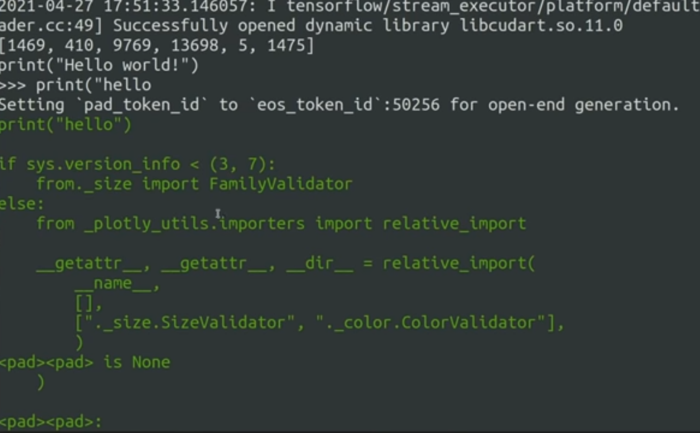

# Python code generator

## Requirements

First remeber to install `github` modue which can be installed easily using below command:
```
pip install PyGithub 
```

## Getting data
To get data I used `Github` repositories. For this I used `Github` api, to get data you need to run bellow command:
```
python data_collector.py
```

It will collects python repostiroes in last 3 days which have size less that `5MB`. You can change it as you wish.

By the way, remember that you need to get your own token. For this got to <a href="https://github.com/settings/tokens">this link</a>. After getting your token make a `token.txt` file next to `data_collector` and put your token in that file.

## Preprocess

Preprocess stage includes tokenizing and creating the datafile. Use the files in preprocess folder to do the preprocess.


## Training model

Use `trainer.py` in model directory to train your model. This can be easily done using this command:
```
python trainer,py
```

After this the model will be save in `GPyT` directory for next stages.


## Check model

An example of model check is available in `model` directory.

Here is an example output:



*Made By Amirhossein Abaskohi*
